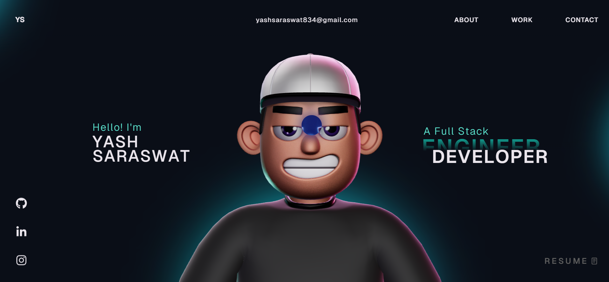

# My Portfolio Wesbite - Overview 🚀

This repository contains the source code for my personal developer portfolio, built to showcase my projects, technical skills, and experience in building real-world web applications.

As a Computer Science student and full-stack web developer, I focus on creating scalable and practical products that solve everyday problems. My portfolio highlights the projects I have built, including PreOrder.Food, a production-level platform designed to help students pre-order food from college canteens and avoid long queues.

The goal of this portfolio is to provide a central place where people can explore my work, understand the technologies I use, and follow my journey as a developer building impactful digital products.

🚀 Portfolio Features

Modern and responsive design

Project showcase section

Skills and technologies section

Contact section

Clean and minimal user interface

**Techstack** - React, TypeScript, GSAP, ThreeJS, WebGL, HTML, Css, JavaScript

🌍 Live Website

You can view the live portfolio here:

https://your-portfolio-link.com

## License

This project is open source and available under the [MIT License](LICENSE).
